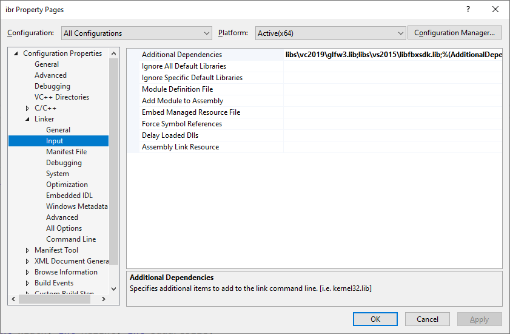

# Installation

Téléchargez le SDK fbx sur le site officiel d'Autodesk. Le but est de récupérer les répertoire ```include``` et ```lib```. (Via installation ou juste dézippage via 7zip du .exe).

Voilà les fichiers qui seront rajoutés à la racine de votre projet :
```
include/
├── fbxsdk
│   ├── core
│   ├── fbxsdk_def.h
│   ├── fbxsdk_nsbegin.h
│   ├── fbxsdk_nsend.h
│   ├── fbxsdk_version.h
│   ├── fileio
│   ├── scene
│   └── utils
├── fbxsdk.h
libs/
├── vs2015
│   └── libfbxsdk.lib
libfbxsdk.dll
```

## Copie des entêtes

Le projet est d'ores et déjà configuré pour inclure tous les headers situés ```include```. Donc on rajoute les entêtes dans ce répertoire.

Attention à ne pas oublié le fichier ```fbxsdk.h```.

### Copie de la bibliothèque dynamique

On va utiliser la version dynamique, donc il va falloir lier notre programme à libfbxsdk.lib. Récupérez la version x64 et placez-la dans ```ibr/libs/vs2015/libfbxsdk.lib```.

Il faut également copier la dll qui sera utilisée lors du runtime. Le plus simple est de la mettre à la racine du projet ```ibr/libfbxsdk.dll```. De cette façon, le programme pourra être lancé hors de visual studio (ex. Renderdoc) sans problème.

### Configuration du projet Visual Studio

Dans les propriétés de link du projet, ajouter le .lib :



### Vérification du fonctionnement

Dans un fichier .cpp, incluez ```#include <fbxsdk.h>``` puis dans une fonction exécutez la ligne ```FbxManager* lSdkManager = FbxManager::Create();```.
Si le programme se lance, c'est que la bibliothèque est prête à être utilisée !

### Liens :
- Your First FBX SDK Program : http://docs.autodesk.com/FBX/2014/ENU/FBX-SDK-Documentation/index.html?url=cpp_ref/class_fbx_manager.html,topicNumber=cpp_ref_class_fbx_manager_html20827dab-7936-4092-b5e9-c7b174a914b6